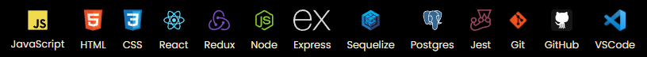

[](https://fernando-barrios.netlify.app/)

<h2><strong>:star: ABOUT ME</strong></h2>
<p><strong>I am a Full-Stack Developer</strong>, with <strong>2 years of experience in the Development of Web APPs, Prototyping, Designing User Interfaces and coding for the Front-End and Back-End.</strong> I am <strong>looking for a job opportunity</strong> where I could share and increase my knowledge. I regard myself as a <strong>problem solving person, collaborative, creative and passionate about programming</strong>, ready to face new challenges.<p>

```javascript
const myStack = {
  code: ["Javascript", "HTML", "CSS", "Java"],
  technologies: [
    {
      frontEnd: {
        javascript: ["React", "Redux"],
        css: ["Styled Components", "CSS Modules"],
      },
    },
    {
      backEnd: {
        javascript: ["Node", "Express", "Sequelize"],
      },
      databases: ["PostgreSQL"],
    },
    {
      Others: {
        prototyping: ["Figma", "Adobe XD"],
        design: ["Adobe Illustrator", "Photoshop"],
      },
    },
  ],
  currentStatus: ["✨Looking for a Job✨"],
  locationPreferences: ["✨Fully Remote✨"],
};
```

- 🔭 I’m currently working on a <strong>Ecommerce Fullstack Project...</strong>
- 🌱 I’m currently learning <strong>Material UI</strong> for the Frontend...
- 💬 Ask me about <strong>JavaScript, HTML, CSS, Styled Components, React, Redux, Node, Express, Sequelize, Postgres...</strong>
- 💼 During my working life I have worked with teams in areas of sales systems consulting and administrative management for companies, technical support and administration, which have given me not only experience but discipline at work.
- ⚡ <a href="https://fernando-barrios.netlify.app/" target="_blank">CV Online</a>

<h2><strong>🛠 LANGUAGES AND TECHNOLOGIES STACK</strong></h2>


<h2><strong>💼 INDIVIDUAL FULLSTACK PROJECT (COUNTRIES)</strong></h2>


<h4><strong>SEE PROJECT ON VIDEO</strong></h4>
<a href="https://youtu.be/z0PxtOxrJWg" alt="countries-youtube" target="_blank"></a>
<a href="https://vimeo.com/user158728760/review/668887098/b0214389f8" alt="countries-vimeo" target="_blank"></a>

<h2><strong>📫 HOW TO REACH ME</strong></h2>
<div>
  <a href = "mailto:fbarrios.pyc@gmail.com"></a>
</div>

<h2>:pushpin: NETWORKS</h2>
<a href="https://www.linkedin.com/in/fernandolba/" target="_blank"></a>


<h2>:eyes: HOW MANY VISITS I HAVE</h2>
<p align="left"></p>


[](https://github.com/fernandolba/github-readme-stats)